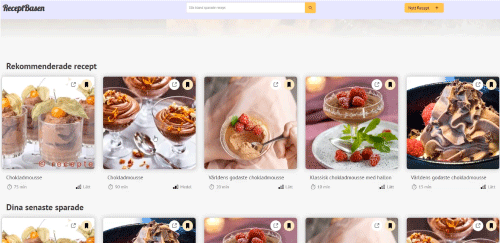
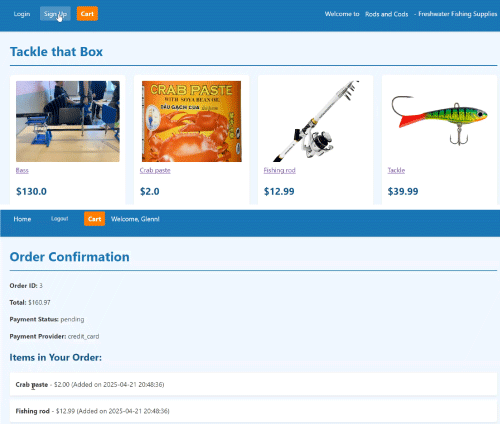
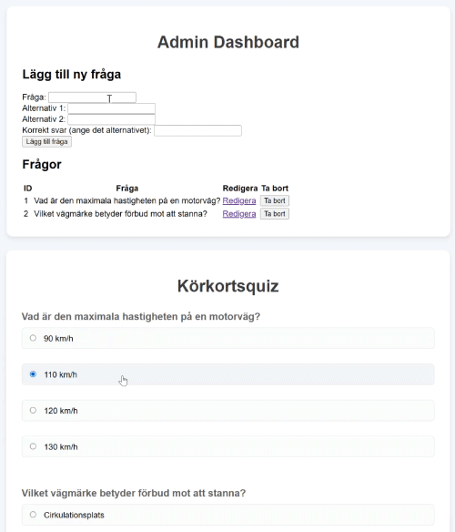

# Slutprojekt / Projekt #3 - Webbserverprogrammering 1
Enskillt slutprojekt under hela vårterminen 2025 i kursen Webbserverprogrammering 1 på NTI Johanneberg.

Under hela vårterminen kommer du att bygga en webbapplikation med de tekniker vi har lärt oss i kursen Webbserverprogrammering. Målet är att du ska få en användbar & fungerande webbapplikation.

Du får välja att bygga vad du vill så länge det är rimliga projekt. Du kan t.ex. bygga:

 - Blogg
 - Webbshop
 - Receptsida
 - Forum
 - Köp & sälj

**Exempel på tidigare projekt**

  
*Elevexempel: Recepsida*

  
*Elevexempel: Webshop*

  
*Elevexempel: Körkortsquiz*

## Uppgiftsbeskrivning & specifikation
- Webbapplikation i `Ruby` med `Sinatra` och `SQLite`. 
- Individuellt projekt
- Ta inspiration från dina tidigare projekt för att t.ex. skapa din _seeder_
- Forka [detta repot](https://github.com/ntijoh-ola-lindberg/wsp1-slutprojekt) och arbeta i för ditt projekt.
- Öppna `Issues` och `Github discussions` på [ditt Github-repository](https://docs.github.com/en/repositories/managing-your-repositorys-settings-and-features/enabling-features-for-your-repository).
- Bjud in mig: _ntijoh-ola-lindberg_
- All kod har ni på ert Github-repo
- Ni skriver i loggboken varje vecka (loggboksfrågor finns längre ner)
- Vid slutinlämning: Lämna in en liten film på classroom som visar applikationen
- Under projektet kommer vi ha genomgångar och avstämningar för fler tekniker och avstämningsuppgifter. Jag har planerat att vi gör minst sekvensdiagram och E/R diagram.
- På vägen kommer du få löpande tips för hur du kan göra koden snyggare, bättre och lättare att hantera. Främst via loggboken och Github.

## Lärandemål
- Förstå hur de olika delarna i webbappen hänger ihop
- Kunna förklara alla steg när en användare ändrar informationen
- Arbeta med självständigt med utveckling och felsökning jämfört med tidigare projekt

## Loggboksfrågor

Varje lektion svarar ni på följande frågor. Efter genomgångar eller andra övningar kommer vi antingen byta ut frågor eller lägga till frågor till dessa.

### Vad har jag lärt mig idag? ###
*Beskriv konkret en sak du förstår bättre än innan, t.ex. djupare förståelse för vilken kod som används genom hela din app när du till exempel tar bort en användare. Du kan fundera på något du gjorde själv som fungerade eller något du testade som inte fungerade och som lärde dig något av.*

### Vilka problem / utmaningar stötte jag på? ###
*Vilka buggar, fel, problem eller frågetecken dök upp när du arbetade idag?
Hur försökte du lösa dem, eller vad skulle du göra nästa gång för att lösa problemet?*

### Vad ska du göra nästa gång? ### 
*Vilken funktion, route, vy eller databasdel ska du jobba med nästa gång?
Formulera ett tydligt mini-mål för dig själv.*

## 🗒️ Projektplan

Alla skapar en projektplan som innehåller minst följande 4 punkter. Du skriver den i din loggbok. Alla bör uppdateras efter hand som projektet växer.

1. __Projektbeskrivning__ Beskriv vad applikationen ska kunna göra och vilka olika delar av applikationen som finns. Vem ska använda applikationen? Vilka tekniska lösningar använder du (frontend, backend, databas, versionshantering)? Hur hänger delarna ihop?
2. __Vyer__ Blyertskisser på papper.
3. __Databas__ Bild på detaljerat ER-diagram. Kan utvecklas under projektets gång men du behöver ha arbeta fram en grund här.
4. __Arkitektur__ Beskriv filer och mappar - vad gör/innehåller de? Skrivs efter hand.

## Bedömning

A-F Beskrivning finns på Classroom

## Installation

1. `bundle install` | Installerar de biblotek (tex. SQLite) du behöver
2. `rake` | Startar appen. Finns det ingen databas skapas en ny i `db/sqlite.db`
3. `ctrl + c` | Stänger webbservern
4. `rake seed` | Återställer databasen från seed-filen
5. `rake kill` | Stänger av alla Ruby om du t.ex. har problem att få igång webbservern med felmeddelande ungefär som `Address already in use - bind(2) for 0.0.0.0:9292` 

Använd verktyget `DB Browser for SQLite` för att titta på, arbeta fram och testa SQL-kod.
